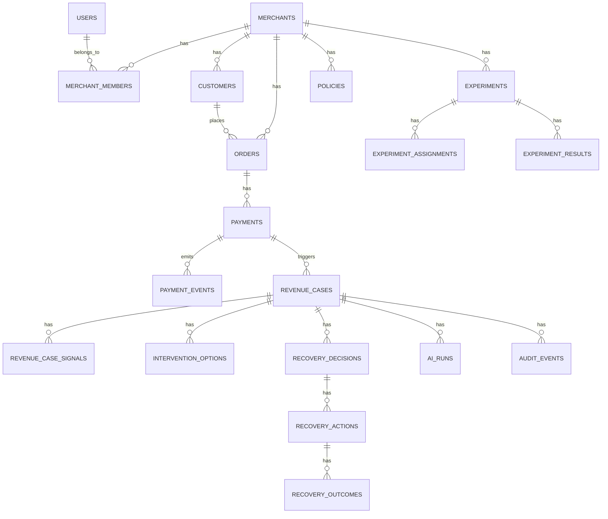

# REVIVE — Data Model

## Money Convention

All monetary values stored as **BIGINT** in minor currency units (paise for INR).

```
₹24,999 → amount_minor = 2499900, currency = 'INR'
```

**NEVER** use `FLOAT`, `DOUBLE`, or JavaScript floating-point arithmetic for financial calculations.

---

## Entity Relationship Summary



---

## Tables

### `users`
Maps to Clerk users.

| Column | Type | Constraints | Notes |
|--------|------|-------------|-------|
| id | UUID | PK, DEFAULT gen_random_uuid() | |
| clerk_user_id | VARCHAR(255) | UNIQUE, NOT NULL | Clerk external ID |
| email | VARCHAR(255) | NOT NULL | |
| display_name | VARCHAR(255) | | |
| created_at | TIMESTAMPTZ | NOT NULL, DEFAULT NOW() | |
| updated_at | TIMESTAMPTZ | NOT NULL, DEFAULT NOW() | |

---

### `merchants`

| Column | Type | Constraints | Notes |
|--------|------|-------------|-------|
| id | UUID | PK, DEFAULT gen_random_uuid() | |
| name | VARCHAR(255) | NOT NULL | |
| slug | VARCHAR(255) | UNIQUE, NOT NULL | URL-friendly identifier |
| category | VARCHAR(100) | | e.g., 'electronics', 'saas' |
| razorpay_account_id | VARCHAR(255) | | Test mode account |
| settings | JSONB | DEFAULT '{}' | Merchant-level config |
| created_at | TIMESTAMPTZ | NOT NULL, DEFAULT NOW() | |
| updated_at | TIMESTAMPTZ | NOT NULL, DEFAULT NOW() | |

---

### `merchant_members`

| Column | Type | Constraints | Notes |
|--------|------|-------------|-------|
| id | UUID | PK, DEFAULT gen_random_uuid() | |
| merchant_id | UUID | FK → merchants(id), NOT NULL | |
| user_id | UUID | FK → users(id), NOT NULL | |
| role | VARCHAR(50) | NOT NULL, DEFAULT 'member' | 'owner', 'admin', 'member' |
| created_at | TIMESTAMPTZ | NOT NULL, DEFAULT NOW() | |

**Unique**: (merchant_id, user_id)

---

### `customers`

| Column | Type | Constraints | Notes |
|--------|------|-------------|-------|
| id | UUID | PK, DEFAULT gen_random_uuid() | |
| merchant_id | UUID | FK → merchants(id), NOT NULL | |
| external_id | VARCHAR(255) | | Merchant's customer ID |
| email_hash | VARCHAR(255) | | Hashed for privacy |
| display_id | VARCHAR(50) | NOT NULL | Masked identifier e.g., "cust_8f2…" |
| segment | VARCHAR(100) | | 'new', 'repeat', 'high_value' |
| total_orders | INTEGER | DEFAULT 0 | |
| total_success_payments | INTEGER | DEFAULT 0 | |
| total_failed_payments | INTEGER | DEFAULT 0 | |
| lifetime_value_minor | BIGINT | DEFAULT 0 | |
| currency | VARCHAR(3) | DEFAULT 'INR' | |
| first_seen_at | TIMESTAMPTZ | | |
| last_seen_at | TIMESTAMPTZ | | |
| created_at | TIMESTAMPTZ | NOT NULL, DEFAULT NOW() | |
| updated_at | TIMESTAMPTZ | NOT NULL, DEFAULT NOW() | |

**Index**: (merchant_id), (merchant_id, external_id)

---

### `orders`

| Column | Type | Constraints | Notes |
|--------|------|-------------|-------|
| id | UUID | PK, DEFAULT gen_random_uuid() | |
| merchant_id | UUID | FK → merchants(id), NOT NULL | |
| customer_id | UUID | FK → customers(id), NOT NULL | |
| external_order_id | VARCHAR(255) | | Razorpay/merchant order ID |
| amount_minor | BIGINT | NOT NULL | |
| currency | VARCHAR(3) | NOT NULL, DEFAULT 'INR' | |
| status | VARCHAR(50) | NOT NULL, DEFAULT 'created' | |
| payment_method | VARCHAR(50) | | 'upi', 'card', 'netbanking', 'wallet' |
| metadata | JSONB | DEFAULT '{}' | |
| created_at | TIMESTAMPTZ | NOT NULL, DEFAULT NOW() | |
| updated_at | TIMESTAMPTZ | NOT NULL, DEFAULT NOW() | |

**Index**: (merchant_id), (customer_id), (status)

---

### `payments`

| Column | Type | Constraints | Notes |
|--------|------|-------------|-------|
| id | UUID | PK, DEFAULT gen_random_uuid() | |
| merchant_id | UUID | FK → merchants(id), NOT NULL | |
| order_id | UUID | FK → orders(id), NOT NULL | |
| customer_id | UUID | FK → customers(id), NOT NULL | |
| external_payment_id | VARCHAR(255) | | Razorpay payment ID |
| amount_minor | BIGINT | NOT NULL | |
| currency | VARCHAR(3) | NOT NULL, DEFAULT 'INR' | |
| status | VARCHAR(50) | NOT NULL, DEFAULT 'created' | |
| payment_method | VARCHAR(50) | | |
| bank | VARCHAR(100) | | |
| failure_reason | VARCHAR(255) | | |
| failure_code | VARCHAR(100) | | |
| attempt_count | INTEGER | NOT NULL, DEFAULT 1 | |
| is_recurring | BOOLEAN | DEFAULT FALSE | |
| authorized_at | TIMESTAMPTZ | | |
| captured_at | TIMESTAMPTZ | | |
| failed_at | TIMESTAMPTZ | | |
| created_at | TIMESTAMPTZ | NOT NULL, DEFAULT NOW() | |
| updated_at | TIMESTAMPTZ | NOT NULL, DEFAULT NOW() | |

**Index**: (merchant_id), (order_id), (customer_id), (status), (external_payment_id)

---

### `payment_events`
Append-only event log.

| Column | Type | Constraints | Notes |
|--------|------|-------------|-------|
| id | UUID | PK, DEFAULT gen_random_uuid() | |
| merchant_id | UUID | FK → merchants(id), NOT NULL | |
| payment_id | UUID | FK → payments(id) | |
| event_type | VARCHAR(100) | NOT NULL | e.g., 'payment.failed' |
| event_id | VARCHAR(255) | NOT NULL | External/internal event ID |
| source | VARCHAR(100) | NOT NULL | 'razorpay', 'synthetic', 'internal' |
| source_event_id | VARCHAR(255) | | Original webhook event ID |
| payload | JSONB | NOT NULL | |
| payload_hash | VARCHAR(64) | | SHA-256 for dedup |
| processing_status | VARCHAR(50) | NOT NULL, DEFAULT 'pending' | 'pending', 'processed', 'failed', 'duplicate' |
| processed_at | TIMESTAMPTZ | | |
| received_at | TIMESTAMPTZ | NOT NULL, DEFAULT NOW() | |
| created_at | TIMESTAMPTZ | NOT NULL, DEFAULT NOW() | |

**Unique**: (source, source_event_id) — idempotency
**Index**: (merchant_id), (payment_id), (event_type), (processing_status)

---

### `revenue_cases`

| Column | Type | Constraints | Notes |
|--------|------|-------------|-------|
| id | UUID | PK, DEFAULT gen_random_uuid() | |
| merchant_id | UUID | FK → merchants(id), NOT NULL | |
| payment_id | UUID | FK → payments(id) | |
| customer_id | UUID | FK → customers(id) | |
| order_id | UUID | FK → orders(id) | |
| case_type | VARCHAR(50) | NOT NULL | 'payment_failure', 'checkout_abandonment', 'subscription_failure' |
| status | VARCHAR(50) | NOT NULL, DEFAULT 'new' | State machine value |
| priority | VARCHAR(20) | DEFAULT 'medium' | 'low', 'medium', 'high', 'critical' |
| amount_at_risk_minor | BIGINT | NOT NULL | |
| currency | VARCHAR(3) | NOT NULL, DEFAULT 'INR' | |
| failure_reason | VARCHAR(255) | | |
| failure_code | VARCHAR(100) | | |
| root_cause | VARCHAR(255) | | AI-determined |
| root_cause_confidence | REAL | | 0.0 - 1.0 |
| recovery_probability | REAL | | 0.0 - 1.0 |
| model_version | VARCHAR(50) | | |
| selected_intervention | VARCHAR(100) | | |
| expected_recovery_minor | BIGINT | | |
| actual_recovery_minor | BIGINT | DEFAULT 0 | |
| intervention_cost_minor | BIGINT | DEFAULT 0 | |
| net_recovery_minor | BIGINT | DEFAULT 0 | |
| retry_count | INTEGER | DEFAULT 0 | |
| customer_contacts | INTEGER | DEFAULT 0 | |
| escalated | BOOLEAN | DEFAULT FALSE | |
| escalation_reason | VARCHAR(255) | | |
| experiment_id | UUID | FK → experiments(id) | |
| experiment_group | VARCHAR(20) | | 'baseline', 'revive' |
| resolved_at | TIMESTAMPTZ | | |
| expires_at | TIMESTAMPTZ | | |
| created_at | TIMESTAMPTZ | NOT NULL, DEFAULT NOW() | |
| updated_at | TIMESTAMPTZ | NOT NULL, DEFAULT NOW() | |

**Index**: (merchant_id), (status), (case_type), (customer_id), (payment_id), (experiment_id), (created_at)

---

### `revenue_case_signals`
Evidence/signals attached to a case.

| Column | Type | Constraints | Notes |
|--------|------|-------------|-------|
| id | UUID | PK, DEFAULT gen_random_uuid() | |
| case_id | UUID | FK → revenue_cases(id), NOT NULL | |
| signal_type | VARCHAR(100) | NOT NULL | 'payment_history', 'failure_pattern', 'customer_behavior' |
| signal_data | JSONB | NOT NULL | |
| source | VARCHAR(100) | | 'agent_tool', 'system', 'manual' |
| created_at | TIMESTAMPTZ | NOT NULL, DEFAULT NOW() | |

**Index**: (case_id)

---

### `intervention_options`
Simulated interventions for a case.

| Column | Type | Constraints | Notes |
|--------|------|-------------|-------|
| id | UUID | PK, DEFAULT gen_random_uuid() | |
| case_id | UUID | FK → revenue_cases(id), NOT NULL | |
| action_type | VARCHAR(100) | NOT NULL | 'no_action', 'retry_payment', etc. |
| recovery_probability | REAL | NOT NULL | 0.0 - 1.0 |
| expected_recovery_minor | BIGINT | NOT NULL | |
| intervention_cost_minor | BIGINT | NOT NULL, DEFAULT 0 | |
| expected_net_value_minor | BIGINT | NOT NULL | |
| customer_friction | REAL | NOT NULL, DEFAULT 0 | 0.0 - 1.0 |
| risk_score | REAL | NOT NULL, DEFAULT 0 | 0.0 - 1.0 |
| confidence | REAL | NOT NULL | 0.0 - 1.0 |
| is_selected | BOOLEAN | DEFAULT FALSE | |
| is_policy_approved | BOOLEAN | | |
| policy_rejection_reason | VARCHAR(255) | | |
| reasoning | TEXT | | AI explanation |
| model_version | VARCHAR(50) | | |
| currency | VARCHAR(3) | NOT NULL, DEFAULT 'INR' | |
| created_at | TIMESTAMPTZ | NOT NULL, DEFAULT NOW() | |

**Index**: (case_id)

---

### `recovery_decisions`

| Column | Type | Constraints | Notes |
|--------|------|-------------|-------|
| id | UUID | PK, DEFAULT gen_random_uuid() | |
| case_id | UUID | FK → revenue_cases(id), NOT NULL | |
| merchant_id | UUID | FK → merchants(id), NOT NULL | |
| intervention_option_id | UUID | FK → intervention_options(id) | |
| action_type | VARCHAR(100) | NOT NULL | |
| reason | TEXT | NOT NULL | |
| input_signals | JSONB | | |
| model_version | VARCHAR(50) | | |
| policy_version | VARCHAR(50) | | |
| confidence | REAL | | |
| expected_recovery_minor | BIGINT | | |
| expected_cost_minor | BIGINT | | |
| expected_customer_friction | REAL | | |
| decision_status | VARCHAR(50) | NOT NULL, DEFAULT 'pending' | 'pending', 'approved', 'rejected', 'auto_approved' |
| decided_by | VARCHAR(100) | | 'system', 'agent', 'human', user_id |
| decided_at | TIMESTAMPTZ | | |
| currency | VARCHAR(3) | NOT NULL, DEFAULT 'INR' | |
| created_at | TIMESTAMPTZ | NOT NULL, DEFAULT NOW() | |

**Index**: (case_id), (merchant_id), (decision_status)

---

### `recovery_actions`

| Column | Type | Constraints | Notes |
|--------|------|-------------|-------|
| id | UUID | PK, DEFAULT gen_random_uuid() | |
| case_id | UUID | FK → revenue_cases(id), NOT NULL | |
| decision_id | UUID | FK → recovery_decisions(id), NOT NULL | |
| merchant_id | UUID | FK → merchants(id), NOT NULL | |
| action_type | VARCHAR(100) | NOT NULL | |
| status | VARCHAR(50) | NOT NULL, DEFAULT 'pending' | |
| attempt_number | INTEGER | NOT NULL, DEFAULT 1 | |
| max_attempts | INTEGER | NOT NULL, DEFAULT 2 | |
| external_reference_id | VARCHAR(255) | | Razorpay payment/link ID |
| request_payload | JSONB | | |
| response_payload | JSONB | | |
| error_message | TEXT | | |
| timeout_seconds | INTEGER | DEFAULT 300 | |
| started_at | TIMESTAMPTZ | | |
| completed_at | TIMESTAMPTZ | | |
| created_at | TIMESTAMPTZ | NOT NULL, DEFAULT NOW() | |

**Index**: (case_id), (decision_id), (merchant_id), (status)

---

### `recovery_outcomes`

| Column | Type | Constraints | Notes |
|--------|------|-------------|-------|
| id | UUID | PK, DEFAULT gen_random_uuid() | |
| case_id | UUID | FK → revenue_cases(id), NOT NULL | |
| action_id | UUID | FK → recovery_actions(id), NOT NULL | |
| merchant_id | UUID | FK → merchants(id), NOT NULL | |
| outcome_type | VARCHAR(50) | NOT NULL | 'recovered', 'failed', 'partial', 'expired' |
| recovered_amount_minor | BIGINT | NOT NULL, DEFAULT 0 | |
| currency | VARCHAR(3) | NOT NULL, DEFAULT 'INR' | |
| verification_method | VARCHAR(100) | | 'webhook', 'api_poll', 'simulation' |
| verification_data | JSONB | | |
| time_to_recovery_seconds | INTEGER | | |
| created_at | TIMESTAMPTZ | NOT NULL, DEFAULT NOW() | |

**Index**: (case_id), (action_id), (merchant_id), (outcome_type)

---

### `policies`

| Column | Type | Constraints | Notes |
|--------|------|-------------|-------|
| id | UUID | PK, DEFAULT gen_random_uuid() | |
| merchant_id | UUID | FK → merchants(id), NOT NULL | |
| policy_version | VARCHAR(50) | NOT NULL | |
| rules | JSONB | NOT NULL | Policy rules |
| max_retry_attempts | INTEGER | NOT NULL, DEFAULT 2 | |
| max_customer_contacts | INTEGER | NOT NULL, DEFAULT 2 | |
| max_discount_percent | INTEGER | NOT NULL, DEFAULT 5 | |
| max_automated_recovery_minor | BIGINT | NOT NULL, DEFAULT 10000000 | ₹1,00,000 |
| high_value_threshold_minor | BIGINT | NOT NULL, DEFAULT 5000000 | ₹50,000 |
| min_recovery_probability | REAL | NOT NULL, DEFAULT 0.1 | |
| min_confidence | REAL | NOT NULL, DEFAULT 0.3 | |
| allowed_actions | JSONB | NOT NULL | Array of allowed action types |
| is_active | BOOLEAN | NOT NULL, DEFAULT TRUE | |
| created_at | TIMESTAMPTZ | NOT NULL, DEFAULT NOW() | |

**Index**: (merchant_id, is_active)

---

### `policy_evaluations`

| Column | Type | Constraints | Notes |
|--------|------|-------------|-------|
| id | UUID | PK, DEFAULT gen_random_uuid() | |
| case_id | UUID | FK → revenue_cases(id), NOT NULL | |
| policy_id | UUID | FK → policies(id), NOT NULL | |
| decision_id | UUID | FK → recovery_decisions(id) | |
| action_type | VARCHAR(100) | NOT NULL | |
| result | VARCHAR(50) | NOT NULL | 'approved', 'blocked', 'escalated' |
| rules_evaluated | JSONB | NOT NULL | |
| rules_triggered | JSONB | NOT NULL | |
| blocking_reason | VARCHAR(255) | | |
| created_at | TIMESTAMPTZ | NOT NULL, DEFAULT NOW() | |

**Index**: (case_id), (policy_id)

---

### `ai_runs`

| Column | Type | Constraints | Notes |
|--------|------|-------------|-------|
| id | UUID | PK, DEFAULT gen_random_uuid() | |
| case_id | UUID | FK → revenue_cases(id), NOT NULL | |
| merchant_id | UUID | FK → merchants(id), NOT NULL | |
| run_type | VARCHAR(100) | NOT NULL | 'root_cause', 'simulation', 'explanation' |
| provider | VARCHAR(50) | | 'openai', 'google', 'deterministic' |
| model | VARCHAR(100) | | |
| model_version | VARCHAR(50) | | |
| prompt_tokens | INTEGER | | |
| completion_tokens | INTEGER | | |
| latency_ms | INTEGER | | |
| input_data | JSONB | | |
| output_data | JSONB | | |
| tool_calls | JSONB | | Array of tools called |
| status | VARCHAR(50) | NOT NULL | 'success', 'failed', 'timeout', 'fallback' |
| error_message | TEXT | | |
| created_at | TIMESTAMPTZ | NOT NULL, DEFAULT NOW() | |

**Index**: (case_id), (merchant_id), (run_type)

---

### `audit_events`
Append-only audit ledger.

| Column | Type | Constraints | Notes |
|--------|------|-------------|-------|
| id | UUID | PK, DEFAULT gen_random_uuid() | |
| merchant_id | UUID | NOT NULL | |
| entity_type | VARCHAR(100) | NOT NULL | 'revenue_case', 'payment', 'decision', etc. |
| entity_id | UUID | NOT NULL | |
| event_type | VARCHAR(100) | NOT NULL | 'case.created', 'decision.approved', etc. |
| actor | VARCHAR(255) | | 'system', 'agent', user_id |
| data | JSONB | | Event-specific data |
| correlation_id | VARCHAR(255) | | Request/trace correlation |
| created_at | TIMESTAMPTZ | NOT NULL, DEFAULT NOW() | |

**Index**: (merchant_id), (entity_type, entity_id), (event_type), (created_at), (correlation_id)

> **Note**: This table is append-only. No UPDATE or DELETE operations allowed.

---

### `experiments`

| Column | Type | Constraints | Notes |
|--------|------|-------------|-------|
| id | UUID | PK, DEFAULT gen_random_uuid() | |
| merchant_id | UUID | FK → merchants(id), NOT NULL | |
| name | VARCHAR(255) | NOT NULL | |
| description | TEXT | | |
| status | VARCHAR(50) | NOT NULL, DEFAULT 'created' | |
| total_events | INTEGER | DEFAULT 0 | |
| baseline_size | INTEGER | DEFAULT 0 | |
| revive_size | INTEGER | DEFAULT 0 | |
| seed | BIGINT | | Deterministic seed |
| config | JSONB | DEFAULT '{}' | |
| started_at | TIMESTAMPTZ | | |
| completed_at | TIMESTAMPTZ | | |
| created_at | TIMESTAMPTZ | NOT NULL, DEFAULT NOW() | |

**Index**: (merchant_id), (status)

---

### `experiment_assignments`

| Column | Type | Constraints | Notes |
|--------|------|-------------|-------|
| id | UUID | PK, DEFAULT gen_random_uuid() | |
| experiment_id | UUID | FK → experiments(id), NOT NULL | |
| case_id | UUID | FK → revenue_cases(id), NOT NULL | |
| group_name | VARCHAR(20) | NOT NULL | 'baseline', 'revive' |
| created_at | TIMESTAMPTZ | NOT NULL, DEFAULT NOW() | |

**Unique**: (experiment_id, case_id)
**Index**: (experiment_id, group_name)

---

### `experiment_results`

| Column | Type | Constraints | Notes |
|--------|------|-------------|-------|
| id | UUID | PK, DEFAULT gen_random_uuid() | |
| experiment_id | UUID | FK → experiments(id), NOT NULL | |
| group_name | VARCHAR(20) | NOT NULL | |
| total_cases | INTEGER | NOT NULL | |
| recovered_cases | INTEGER | NOT NULL | |
| recovery_rate | REAL | NOT NULL | |
| total_amount_at_risk_minor | BIGINT | NOT NULL | |
| recovered_amount_minor | BIGINT | NOT NULL | |
| net_recovered_minor | BIGINT | NOT NULL | |
| intervention_rate | REAL | | |
| false_intervention_rate | REAL | | |
| customer_contact_rate | REAL | | |
| avg_recovery_time_seconds | REAL | | |
| avg_decision_latency_ms | REAL | | |
| policy_violations | INTEGER | DEFAULT 0 | |
| escalation_rate | REAL | | |
| currency | VARCHAR(3) | NOT NULL, DEFAULT 'INR' | |
| computed_at | TIMESTAMPTZ | NOT NULL, DEFAULT NOW() | |

**Index**: (experiment_id, group_name)

---

### `incidents`

| Column | Type | Constraints | Notes |
|--------|------|-------------|-------|
| id | UUID | PK, DEFAULT gen_random_uuid() | |
| merchant_id | UUID | FK → merchants(id), NOT NULL | |
| incident_type | VARCHAR(100) | NOT NULL | 'payment_degradation', 'bank_outage' |
| title | VARCHAR(255) | NOT NULL | |
| description | TEXT | | |
| status | VARCHAR(50) | NOT NULL, DEFAULT 'active' | |
| severity | VARCHAR(20) | NOT NULL, DEFAULT 'medium' | |
| affected_segment | JSONB | | bank, payment method, etc. |
| revenue_impact_minor | BIGINT | DEFAULT 0 | |
| cases_created | INTEGER | DEFAULT 0 | |
| cases_recovered | INTEGER | DEFAULT 0 | |
| root_cause | TEXT | | |
| currency | VARCHAR(3) | NOT NULL, DEFAULT 'INR' | |
| detected_at | TIMESTAMPTZ | | |
| resolved_at | TIMESTAMPTZ | | |
| created_at | TIMESTAMPTZ | NOT NULL, DEFAULT NOW() | |
| updated_at | TIMESTAMPTZ | NOT NULL, DEFAULT NOW() | |

**Index**: (merchant_id), (status), (incident_type)

---

### `notifications`

| Column | Type | Constraints | Notes |
|--------|------|-------------|-------|
| id | UUID | PK, DEFAULT gen_random_uuid() | |
| merchant_id | UUID | FK → merchants(id), NOT NULL | |
| case_id | UUID | FK → revenue_cases(id) | |
| notification_type | VARCHAR(100) | NOT NULL | 'payment_link', 'reminder', 'escalation' |
| channel | VARCHAR(50) | NOT NULL | 'email', 'sms', 'in_app' |
| recipient | VARCHAR(255) | | |
| status | VARCHAR(50) | NOT NULL, DEFAULT 'pending' | |
| sent_at | TIMESTAMPTZ | | |
| created_at | TIMESTAMPTZ | NOT NULL, DEFAULT NOW() | |

**Index**: (merchant_id), (case_id), (status)

---

### `simulation_runs`

| Column | Type | Constraints | Notes |
|--------|------|-------------|-------|
| id | UUID | PK, DEFAULT gen_random_uuid() | |
| merchant_id | UUID | FK → merchants(id), NOT NULL | |
| case_id | UUID | FK → revenue_cases(id) | |
| run_type | VARCHAR(50) | NOT NULL | 'single_case', 'batch' |
| status | VARCHAR(50) | NOT NULL, DEFAULT 'pending' | |
| input_config | JSONB | | |
| results | JSONB | | |
| started_at | TIMESTAMPTZ | | |
| completed_at | TIMESTAMPTZ | | |
| created_at | TIMESTAMPTZ | NOT NULL, DEFAULT NOW() | |

**Index**: (merchant_id), (case_id)

---

### `batch_runs`

| Column | Type | Constraints | Notes |
|--------|------|-------------|-------|
| id | UUID | PK, DEFAULT gen_random_uuid() | |
| merchant_id | UUID | FK → merchants(id), NOT NULL | |
| experiment_id | UUID | FK → experiments(id) | |
| run_type | VARCHAR(50) | NOT NULL | 'evaluation', 'simulation', 'recovery' |
| status | VARCHAR(50) | NOT NULL, DEFAULT 'pending' | |
| total_items | INTEGER | DEFAULT 0 | |
| processed_items | INTEGER | DEFAULT 0 | |
| failed_items | INTEGER | DEFAULT 0 | |
| config | JSONB | | |
| results | JSONB | | |
| started_at | TIMESTAMPTZ | | |
| completed_at | TIMESTAMPTZ | | |
| created_at | TIMESTAMPTZ | NOT NULL, DEFAULT NOW() | |

**Index**: (merchant_id), (experiment_id), (status)

---

### `model_versions`

| Column | Type | Constraints | Notes |
|--------|------|-------------|-------|
| id | UUID | PK, DEFAULT gen_random_uuid() | |
| model_name | VARCHAR(100) | NOT NULL | 'recovery_probability', 'failure_classifier' |
| version | VARCHAR(50) | NOT NULL | |
| model_type | VARCHAR(100) | | 'logistic_regression', 'gradient_boosted' |
| features | JSONB | | Feature list |
| hyperparameters | JSONB | | |
| metrics | JSONB | | Training/validation metrics |
| is_active | BOOLEAN | DEFAULT FALSE | |
| created_at | TIMESTAMPTZ | NOT NULL, DEFAULT NOW() | |

**Unique**: (model_name, version)

---

## Required Indexes Summary

All `merchant_id` columns are indexed for multi-tenant queries.

Key composite indexes:
- `payment_events(source, source_event_id)` — idempotency
- `merchant_members(merchant_id, user_id)` — membership check
- `revenue_cases(merchant_id, status)` — dashboard queries
- `audit_events(merchant_id, entity_type, entity_id)` — audit lookup
- `experiment_assignments(experiment_id, group_name)` — experiment analysis
