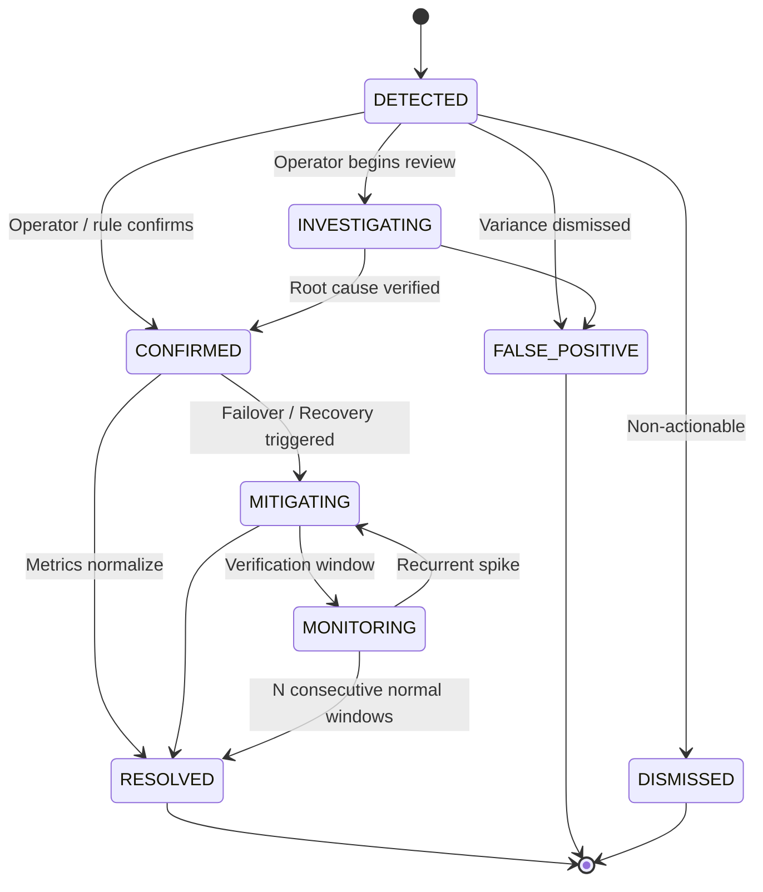

# REVIVE — Incident & Degradation Detection Architecture

## 1. Overview

The REVIVE Incident Detection Engine transforms individual transaction failure events into systemic operational intelligence. It monitors the high-volume financial event stream, aggregates transactions over sliding temporal windows, compares real-time performance against multidimensional baselines, and flags statistical degradation anomalies with exact financial revenue at risk.

```
 RAW PAYMENT EVENTS
        │
        ▼
 ┌────────────────────────────────────────────────────────┐
 │ BATCH / STREAM INGESTION & DEDUPLICATION               │
 │ SHA-256 (source + source_event_id + payload_hash)      │
 └────────────────────────────────────────────────────────┘
        │
        ▼
 ┌────────────────────────────────────────────────────────┐
 │ AGGREGATION ENGINE (Sliding Windows: 1m, 5m, 15m, 60m) │
 │ Slices: Merchant × Payment Method × Bank × Platform    │
 └────────────────────────────────────────────────────────┘
        │
        ▼
 ┌────────────────────────────────────────────────────────┐
 │ BASELINE ENGINE                                        │
 │ Historical Failure Rates & Normal Variance Profiles    │
 └────────────────────────────────────────────────────────┘
        │
        ▼
 ┌────────────────────────────────────────────────────────┐
 │ STATISTICAL ANOMALY DETECTOR                           │
 │ Multi-Threshold Z-Score & Sample Size Gating           │
 └────────────────────────────────────────────────────────┘
        │
        ▼
 ┌────────────────────────────────────────────────────────┐
 │ INCIDENT LIFECYCLE & DEDUPLICATION ENGINE              │
 │ Fingerprint Correlation × Case Linking × Audit Ledger │
 └────────────────────────────────────────────────────────┘
```

---

## 2. Statistical Anomaly Detection Method

Anomaly detection is governed by deterministic statistical rules, not non-deterministic LLMs.

### Conditions for Declaring an Anomaly:
1. **Sample Size Cutoff**: $N \ge \text{minSampleSize}$ (minimum 10–15 transactions per window to prevent false positives from noise).
2. **Absolute Delta**: $\Delta = (\text{observedRate} - \text{baselineRate}) \ge 4.0\%$.
3. **Relative Multiplier**: $\frac{\text{observedRate}}{\text{baselineRate}} \ge 2.0\times$.

```typescript
const isStatisticallyDegraded =
  delta >= MIN_ABSOLUTE_DELTA &&
  relativeChange >= MIN_RELATIVE_MULTIPLIER &&
  sampleSize >= minSampleSize;
```

---

## 3. Revenue-at-Risk Formulation

An incident must calculate financial impact in exact integer minor currency units (`BIGINT paise`) using `Decimal.js` math:

$$\text{Expected Successful GMV} = \text{Total GMV} \times \text{Baseline Success Rate}$$
$$\text{Observed Successful GMV} = \text{Total GMV} \times \text{Observed Success Rate}$$
$$\text{Revenue At Risk} = \max(0, \text{Expected Successful GMV} - \text{Observed Successful GMV})$$

---

## 4. Severity Classification Matrix

| Severity | Criteria |
|---|---|
| **CRITICAL** | Failure Rate $\ge 20\%$ with $N \ge 30$, OR Revenue At Risk $\ge ₹5,00,000$, OR Degradation $\ge 8\times$ Baseline |
| **HIGH** | Failure Rate $\ge 12\%$ with $N \ge 20$, OR Revenue At Risk $\ge ₹1,00,000$, OR Degradation $\ge 4\times$ Baseline |
| **MEDIUM** | Failure Rate $\ge 7\%$ with $N \ge 15$, OR Revenue At Risk $\ge ₹25,000$, OR Degradation $\ge 2.5\times$ Baseline |
| **LOW** | Statistically significant anomaly below Medium threshold |

---

## 5. Incident Deduplication & Correlation

A sustained 45-minute outage produces hundreds of window samples. Instead of spawning duplicate incidents:
1. A deterministic fingerprint is generated:
   $$\text{Fingerprint} = \text{SHA256}(\text{merchant\_id} : \text{payment\_method} : \text{bank} : \text{failure\_code})$$
2. Incoming signals correlate to active incidents matching the fingerprint.
3. Revenue at risk and affected transaction counts accumulate in the existing incident.
4. New failure cases link automatically via foreign key reference (`revenue_cases.incident_id`).

---

## 6. Incident State Machine


