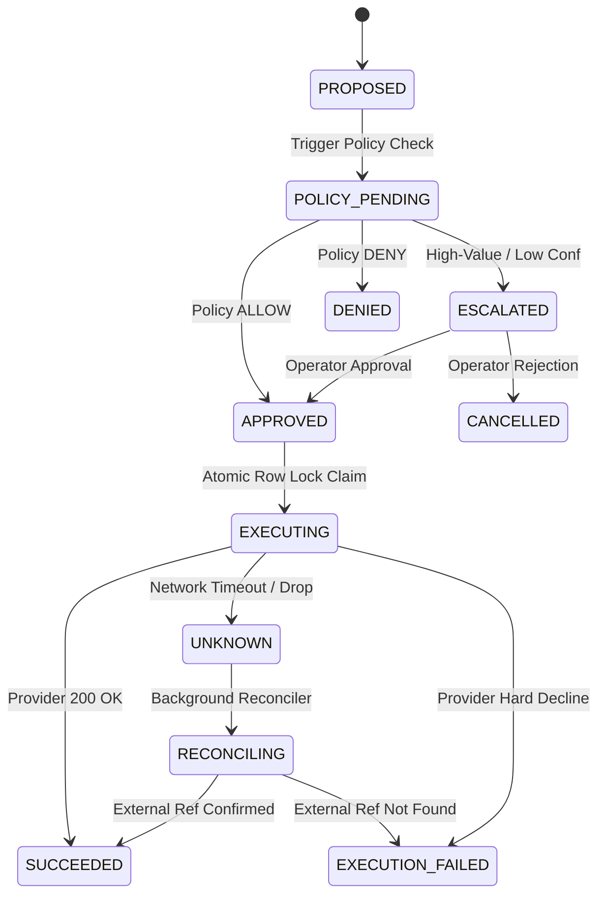

# REVIVE — Recovery Execution & Reconciliation Architecture

## 1. Action State Machine


## 2. Two-Level Idempotency Protection
- **Level 1 (Internal Idempotency)**: Database unique constraint on `(merchant_id, external_reference_id)`. Replays return existing state immediately.
- **Level 2 (External Provider Idempotency)**: Deterministic external idempotency key passed to Razorpay / payment adapters.

## 3. Concurrency Protection
Atomic database update:
```sql
UPDATE recovery_actions
SET status = 'executing'
WHERE id = :id AND status = 'approved';
```
If 100 concurrent requests arrive simultaneously, exactly 1 acquires the execution lock; the other 99 receive the running/completed status without duplicate financial dispatch.
