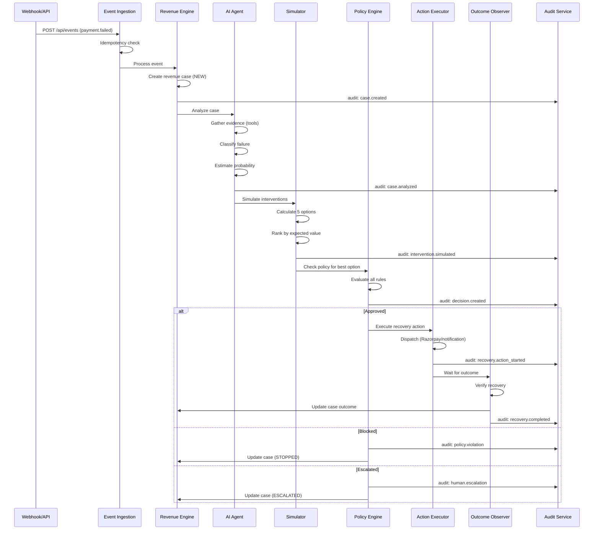

# REVIVE — System Architecture (Detailed)

## Component Diagram

```
┌──────────────────────────────────────────────────────────────────┐
│                         VERCEL                                   │
│  ┌─────────────────────────────────────────────────────────────┐ │
│  │                    Next.js Application                       │ │
│  │                                                             │ │
│  │  ┌──────────────┐  ┌──────────────┐  ┌──────────────────┐  │ │
│  │  │  React UI    │  │  API Routes  │  │  Server Actions  │  │ │
│  │  │  (App Router)│  │  (/api/*)    │  │                  │  │ │
│  │  └──────┬───────┘  └──────┬───────┘  └────────┬─────────┘  │ │
│  │         │                 │                    │             │ │
│  │         └─────────────────┼────────────────────┘             │ │
│  │                           │                                  │ │
│  │              ┌────────────┴────────────┐                     │ │
│  │              │    Service Layer         │                     │ │
│  │              │  ┌──────────────────┐   │                     │ │
│  │              │  │ Revenue Engine   │   │                     │ │
│  │              │  │ Decision Engine  │   │                     │ │
│  │              │  │ Policy Engine    │   │                     │ │
│  │              │  │ Recovery Agent   │   │                     │ │
│  │              │  │ Action Executor  │   │                     │ │
│  │              │  │ Audit Service    │   │                     │ │
│  │              │  │ Eval Framework   │   │                     │ │
│  │              │  └──────────────────┘   │                     │ │
│  │              └────────────┬────────────┘                     │ │
│  │                           │                                  │ │
│  │              ┌────────────┴────────────┐                     │ │
│  │              │    Adapter Layer         │                     │ │
│  │              │  ┌──────────────────┐   │                     │ │
│  │              │  │ DatabaseAdapter  │   │                     │ │
│  │              │  │ AIAdapter        │   │                     │ │
│  │              │  │ PaymentAdapter   │   │                     │ │
│  │              │  │ CacheAdapter     │   │                     │ │
│  │              │  │ EmailAdapter     │   │                     │ │
│  │              │  │ WorkflowAdapter  │   │                     │ │
│  │              │  └──────────────────┘   │                     │ │
│  │              └─────────────────────────┘                     │ │
│  └─────────────────────────────────────────────────────────────┘ │
└────────────┬──────────┬──────────┬──────────┬───────────────────┘
             │          │          │          │
             ▼          ▼          ▼          ▼
        ┌────────┐ ┌────────┐ ┌────────┐ ┌────────┐
        │Supabase│ │Upstash │ │Trigger │ │Razorpay│
        │Postgres│ │Redis   │ │.dev    │ │Test    │
        └────────┘ └────────┘ └────────┘ └────────┘
             │
             ▼
        ┌────────┐  ┌────────┐  ┌────────┐
        │ Clerk  │  │  LLM   │  │ Sentry │
        └────────┘  └────────┘  └────────┘
```

## Request Flow: Event → Recovery


