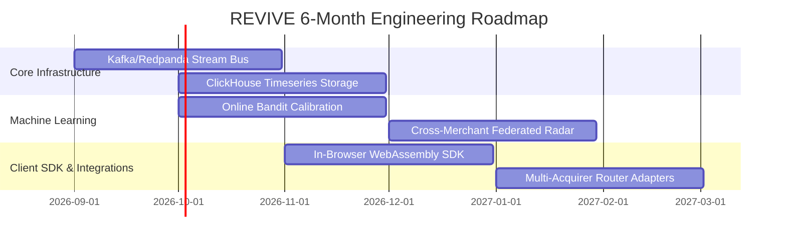

# REVIVE — Architectural Limitations & 6-Month Engineering Roadmap

## 1. Honest Architectural Limitations Today

1. **Synthetic Benchmark Physics**: While the benchmark is deterministic, reproducible, and modeled on Indian payment switch failure distributions, production deployment will encounter unmodeled edge cases in issuer bank behavior.
2. **Test-Mode Payment Adapters**: External gateway integrations currently run against Razorpay Test Mode and local simulation hooks rather than live production merchant credentials.
3. **In-Process Streaming Aggregator**: Telemetry aggregation runs within the Node.js process runtime. High-scale multi-node clustering requires an external distributed stream bus.
4. **Database Batch Ingestion Throughput**: PostgreSQL row insert throughput is $\approx 1,250\text{ events/sec}$, which is sufficient for transactional cases and anomalies, but requires timeseries database offloading for high-volume raw telemetry streams.
5. **Merchant Multi-Acquirer Infrastructure Dependency**: Automated payment rail switching requires the merchant to have multi-acquirer routing enabled (e.g. Razorpay Optimizer or Juspay Hypercheckout). Single-acquirer merchants default to multi-rail payment links.
6. **Static Failure Taxonomy Base Rates**: Probability model base rates and action multipliers are statically tuned and require live settlement feedback for continuous online adaptation.

---

## 2. 6-Month Production Engineering Roadmap

### Month 1–2: Distributed Telemetry & Stream Storage
- Implement Kafka / Redpanda streaming buffer for raw webhook and client telemetry ingestion.
- Deploy ClickHouse / TimescaleDB for sub-millisecond historical baseline querying across billions of events.

### Month 3–4: Online Bandit Calibration & Dynamic Policy
- Transition the Recovery Model from static base rates to continuous online contextual bandits (LinUCB / Thompson Sampling) trained on incoming settlement webhooks.
- Add merchant interchange optimization constraints directly into the Net Expected Value equation.

### Month 5–6: Client-Side WebAssembly SDK & Multi-Acquirer Adapters
- Build an in-checkout WebAssembly SDK that queries the REVIVE radar to switch payment switches *before* checkout submission when degraded rails are detected.
- Build production multi-acquirer routing adapters for Juspay, Razorpay, Stripe, and Adyen.
- Implement privacy-preserving federated telemetry sharing across merchants to detect issuer bank outages in real time.
