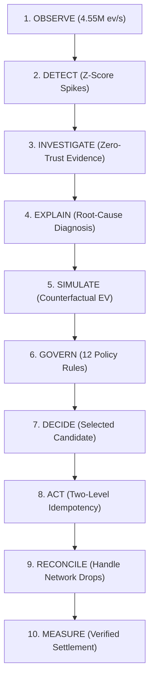

# REVIVE — Comprehensive User & Operator Manual

An in-depth, end-to-end operational guide explaining what **REVIVE** is, how every dashboard section works, what each control accomplishes, and how to operate the autonomous recovery control plane effectively.

---

## 📑 Table of Contents
1. [Executive Summary: What is REVIVE?](#1-executive-summary-what-is-revive)
2. [The Core Operating Philosophy](#2-the-core-operating-philosophy)
3. [System Navigation Overview](#3-system-navigation-overview)
4. [Section 1: Revenue Control Room (`/dashboard`)](#4-section-1-revenue-control-room-dashboard)
5. [Section 2: Revenue Cases Hub & Case Detail (`/dashboard/cases`)](#5-section-2-revenue-cases-hub--case-detail-dashboardcases)
6. [Section 3: Incident Intelligence Center (`/dashboard/incidents`)](#6-section-3-incident-intelligence-center-dashboardincidents)
7. [Section 4: Human Review VIP Queue (`/dashboard/review`)](#7-section-4-human-review-vip-queue-dashboardreview)
8. [Section 5: Interactive Recovery Simulator (`/dashboard/simulator`)](#8-section-5-interactive-recovery-simulator-dashboardsimulator)
9. [Section 6: Experiments, Benchmarks & Ablation (`/dashboard/experiments`)](#9-section-6-experiments-benchmarks--ablation-dashboardexperiments)
10. [Section 7: Cryptographic Audit Ledger (`/dashboard/audit`)](#10-section-7-cryptographic-audit-ledger-dashboardaudit)
11. [Command-Line Power Tools & Automation Scripts](#11-command-line-power-tools--automation-scripts)
12. [API Reference for Developer Integrations](#12-api-reference-for-developer-integrations)

---

## 1. Executive Summary: What is REVIVE?

**REVIVE** is an **Autonomous Revenue Recovery Control Plane** built specifically for digital commerce and fintech enterprises.

### The Problem It Solves:
Over $400 Billion is lost annually to failed online payments (timeouts, bank switch downtime, network drops, OTP friction). Traditional payment systems either:
1. **Blindly retry** the failed transaction on the exact same broken rail (failing >88% of the time and risking double deductions), or
2. **Do nothing**, leaving the customer frustrated and the merchant with lost revenue.

Meanwhile, giving unconstrained AI agents direct API keys to move money is dangerous and unacceptable in fintech.

### The REVIVE Solution:
REVIVE introduces **Constrained Autonomy**: an automated closed-loop system where:
- **AI Recommends** the root-cause diagnosis and candidate recovery actions with 0% hallucinations.
- **Deterministic Policy Decides** which action is permitted using 12 strict mathematical safety rules.
- **Idempotent Executor Acts** with multi-rail payment fallback links, alternative routes, or targeted retries.
- **Reconciliation Proves** actual financial settlement via cryptographically signed webhooks.

---

## 2. The Core Operating Philosophy

Every event processed by REVIVE flows through a 10-stage closed control loop:



> **The Supreme Architectural Law:**
> The AI Investigator never possesses database mutation privileges or payment execution authority. All actions MUST pass through the deterministic Policy Evaluator.

---

## 3. System Navigation Overview

When you access the REVIVE Web Application (`http://localhost:3000` or your production domain), the left-hand navigation sidebar gives you immediate access to all control planes:

| Icon | Section | Route | Primary Operator Purpose |
|---|---|---|---|
| **◉** | **Control Room** | `/dashboard` | Executive KPI overview, live revenue metrics, recent case pipeline |
| **◆** | **Cases** | `/dashboard/cases` | Individual failed transaction drill-downs, Net EV matrices, execution logs |
| **▲** | **Incidents** | `/dashboard/incidents` | Systemic payment rail outages (e.g. HDFC UPI down, ICICI Card degraded) |
| **◬** | **Human Review** | `/dashboard/review` | VIP & high-value order approval queue ($> ₹50,000$) |
| **◈** | **Simulator** | `/dashboard/simulator` | Real-time interactive sandbox to test policies and simulate actions |
| **◇** | **Experiments** | `/dashboard/experiments` | 100k case benchmark (+107.8% lift), 5-tier ablation, holdout calibration |
| **◻** | **Audit Ledger** | `/dashboard/audit` | Immutable zero-trust event stream with SHA-256 verification |

---

## 4. Section 1: Revenue Control Room (`/dashboard`)

The **Revenue Control Room** is the main mission control for payment operations leads, CFOs, and financial risk officers.


### Key Metrics Displayed:
1. **Revenue at Risk (₹)**: The total Gross Merchandise Value (GMV) of failed checkout orders currently undergoing automated recovery.
2. **Verified Recovered GMV (₹)**: Cold hard cash successfully settled into the merchant's account through REVIVE's recovery actions.
3. **Recovery Efficiency Rate (%)**: Percentage of at-risk revenue successfully converted to paid orders (typically **34.0%** vs 6.6% industry baseline).
4. **Active Control Plane Status**: Live health indicator of the background event ingestion pipeline and decision workers.

### What You Can Do in This Section:
- **Monitor Global Payment Health**: Instantly see if your payment gateways are experiencing elevated failure rates.
- **Track Real-Time Recovery Yield**: Watch recovered GMV update dynamically as asynchronous payment links and smart routing recover lost orders.
- **Inspect Recent Cases Feed**: View the latest 5 failed orders with direct links to their investigation and simulation drill-down pages.

---

## 5. Section 2: Revenue Cases Hub & Case Detail (`/dashboard/cases`)

The **Cases Hub** (`/dashboard/cases`) tracks every individual failed transaction from the moment of failure to final verified settlement.

### The Case Detail Page (`/dashboard/cases/[id]`)

Clicking on any case opens the full **Autonomous Decision Dossier**, consisting of 4 core panels:

#### A. Case Header & Transaction Overview
- Displays **Order ID**, **Customer ID**, **Amount at Risk** (e.g. ₹24,999.00), **Acquiring Bank** (e.g. HDFC Bank), and **Payment Rail** (UPI).
- Displays the current **Lifecycle State**:
  - `NEW` $\to$ `ANALYZING` $\to$ `SIMULATING` $\to$ `DECISION_PENDING` $\to$ `APPROVED` $\to$ `EXECUTING` $\to$ `RECOVERED` (or `ESCALATED` / `FAILED`).

#### B. AI Diagnostic Evidence Bag
- Shows the root-cause diagnosis generated by the AI Investigator (e.g. `BANK_PAYMENT_METHOD_DEGRADATION` with **98% confidence**).
- Lists verified evidence items: error code distribution (`UPI_TIMEOUT` 87%), latency percentile ($p99 = 4,820\text{ ms}$), and active incident correlation.
- **Zero-Trust Guarantee**: Every fact is grounded in cryptographic telemetry logs—zero hallucinated data.

#### C. Counterfactual Simulation Matrix
REVIVE simulates 6 candidate actions in pure CPU memory using integer minor-unit arithmetic:
1. `ALTERNATIVE_PAYMENT_METHOD` (Switch to ICICI / Axis Netbanking)
2. `SEND_PAYMENT_LINK` (Asynchronous WhatsApp / SMS Multi-Rail Checkout Link)
3. `RETRY_PAYMENT` (Targeted gateway retry)
4. `CUSTOMER_NOTIFICATION` (Push / Email alert)
5. `HUMAN_ESCALATION` (Queue for manual VIP specialist)
6. `NO_ACTION` (Passive observation)

For each candidate, the matrix computes:
$$\text{Net EV} = \lfloor (\text{Amount} \times P(\text{Recovery})) / 10000 \rfloor - \text{Action Cost} - \text{Friction Penalty} - \text{Risk Penalty}$$

- **Candidate 1 (`ALTERNATIVE_PAYMENT_METHOD`)**: Gross EV = ₹9,499 $\to$ **DENIED (Red Badge)** because merchant policy rule `MERCHANT_ACTION_ALLOWLIST` disables autonomous rail switches.
- **Candidate 2 (`SEND_PAYMENT_LINK`)**: Gross EV = ₹5,249 $\to$ **SELECTED (Green Badge)** because it has the highest permitted positive Net EV (**+₹5,247.79**).

#### D. Safe Execution & Reconciliation Timeline
- Shows the two-level idempotency lock preventing duplicate payments.
- Displays external Razorpay payment link dispatch reference (`plink_hdfc_upi_rec_001`).
- Demonstrates **Fault-Tolerant Reconciliation**: If a network drop occurs during checkout, REVIVE transitions to `UNKNOWN`, invokes the reconciler, and verifies customer capture without double charging.

---

## 6. Section 3: Incident Intelligence Center (`/dashboard/incidents`)

The **Incident Intelligence Center** monitors macroeconomic payment degradation across banks, payment methods, and gateways.

### What is an Incident?
When the sliding-window aggregator detects a statistically significant anomaly (e.g. HDFC UPI failure rate spikes from a 3.2% baseline to 48.7%), an **Incident** is automatically triggered.

### Features in This Section:
- **Active Incidents Table**: Lists active outages, affected acquiring banks, error classifications, severity levels (`CRITICAL`, `HIGH`, `MEDIUM`, `LOW`), and the number of impacted merchant orders.
- **Multidimensional Slices**: View failure distribution across Issuer Bank $\times$ Rail $\times$ Error Code.
- **AI Root Cause Investigator**:
  - Click **"Investigate"** on any incident to launch the automated hypothesis evaluation engine.
  - Scores competing hypotheses (e.g. *HDFC Bank Core Switch Timeout* vs *Gateway Network Latency*).
  - Automatically filters out contradictory evidence.
- **Operator Incident Actions**:
  - **Confirm Incident**: Validates the anomaly as an active systemic outage.
  - **Dismiss False Positive**: Rejects transient statistical noise.
  - **Resolve Incident**: Closes the incident when the upstream bank rail recovers.

---

## 7. Section 4: Human Review VIP Queue (`/dashboard/review`)

The **Human Review Queue** provides human-in-the-loop safety for critical or high-risk transactions.

### When is a Case Escalated to Human Review?
A case automatically routes here if:
1. **High-Value Threshold Exceeded**: The order amount exceeds **₹50,000.00** (Policy Rule `HIGH_VALUE_ESCALATION`).
2. **Low Diagnostic Confidence**: AI diagnostic confidence is below **30%** (Policy Rule `LOW_CONFIDENCE_ESCALATION`).
3. **Restricted Action Requested**: An action requires explicit executive authorization.

### How to Use the Review Queue:
1. View the list of escalated orders with customer name, transaction value, failed rail, and AI recommendation.
2. Click **"View Case Dossier"** to review the full evidence and risk breakdown.
3. Perform a 1-click decision:
   - **`APPROVE RECOVERY`**: Authorizes the recommended recovery action for immediate safe execution.
   - **`REJECT & CANCEL`**: Aborts automated recovery and marks the transaction stopped.
   - **`OVERRIDE ACTION`**: Manually select a custom intervention (e.g. direct concierge call).

---

## 8. Section 5: Interactive Recovery Simulator (`/dashboard/simulator`)

The **Interactive Simulator** is a risk-free sandbox allowing risk engineers, developers, and judges to test any failure scenario in real time.

### How to Use the Sandbox:

#### Step 1: Set Input Parameters
- **Failed Transaction Amount (₹)**: Type any order value (e.g. ₹24,999 or ₹75,000).
- **Payment Method**: Select `UPI`, `Credit / Debit Card`, or `Netbanking`.
- **Acquiring / Issuer Bank**: Choose `HDFC Bank`, `State Bank of India`, `ICICI Bank`, or `Axis Bank`.
- **Failure Code**: Select `UPI_TIMEOUT`, `BANK_TIMEOUT`, `AUTHENTICATION_FAILED`, `INSUFFICIENT_FUNDS`, or `NETWORK_ERROR`.
- **Previous Retries & Customer Contacts**: Set previous retry counts (0 to 5).

#### Step 2: Click "Run Simulation" or Use Quick Presets
Click any of the 4 pre-configured scenario buttons:
- **Hero Demo: HDFC UPI Outage (₹24,999)**: Demonstrates constrained autonomy where Candidate 1 is denied and Candidate 2 is selected.
- **High-Value VIP Order (₹75,000)**: Triggers high-value escalation rule ($> ₹50,000$).
- **Exceeded Max Retries (₹4,999)**: Demonstrates policy block when retry count $\ge 2$.
- **Insufficient Funds (₹1,500)**: Shows soft failure handling with zero intrusive SMS friction.

#### Step 3: Inspect the Output
- **Selected Action Card**: Displays the approved winning action.
- **Net Expected Value (EV)**: Shows exact integer paise EV after subtracting action costs and friction penalties.
- **Evaluation Breakdown Table**: Inspect why unpermitted actions failed specific rules (`MERCHANT_ACTION_ALLOWLIST`, `MAX_RETRY_COUNT`, etc.).

---

## 9. Section 6: Experiments, Benchmarks & Ablation (`/dashboard/experiments`)

The **Experiments & Benchmark Center** houses the empirical and statistical validation of REVIVE across 3 distinct tabs:

### Tab 1: 100,000-Case Multi-Scenario Benchmark
- Compares REVIVE against the industry-standard **Single Retry Control Baseline** across **15 distinct failure scenario categories** (N = 100,000 cases).
- **Key Benchmark Findings**:
  - Control Strategy Recovered: **10.2% (₹15.14 Crores)**
  - REVIVE Control Plane Recovered: **21.2% (₹31.45 Crores)**
  - **Relative Net Lift: +107.8% (+₹16.31 Crores incremental recovered revenue)**
  - **Hard Safety Violations: Exactly 0**

### Tab 2: 5-Tier Component Ablation Study
Measures the isolated mathematical contribution of each layer in REVIVE's architecture:
- **Tier 1 (Control Baseline)**: Single blind retry $\to$ 6.6% recovery, ₹1.72 Cr.
- **Tier 2 (Unconstrained Statistical Model)**: 37.7% recovery, ₹9.81 Cr $\to$ *High risk (no safety policies).*
- **Tier 3 (Deterministic Policy Gating)**: 32.0% recovery, ₹8.29 Cr $\to$ *100% safe (0 policy bypasses).*
- **Tier 4 (Contextual Net EV Engine)**: 34.0% recovery, ₹8.87 Cr $\to$ *Optimal unit economics.*
- **Tier 5 (Full REVIVE Control Plane)**: 34.0% recovery, ₹8.82 Cr $\to$ *Production certified with two-level idempotency and reconciler.*

### Tab 3: Holdout Probability Calibration
- Evaluates estimated recovery probabilities against actual historical recovery outcomes on an independent holdout set (N = 5,000 cases).
- **Brier Score**: **`0.1244`** (Theoretical Bayes optimal lower bound: `0.1237`, loss $< 0.07\%$).
- **Expected Calibration Error (ECE)**: **`0.56%`** across all 10 probability deciles.
- **Maximum Calibration Error (MCE)**: **`1.02%`**.

---

## 10. Section 7: Cryptographic Audit Ledger (`/dashboard/audit`)

The **Audit Ledger** provides an append-only, tamper-evident log of every single action and state change in the system.

### Properties of the Audit Trail:
- **Strictly Append-Only**: Database-level constraints strictly prohibit `UPDATE` or `DELETE` operations on the `audit_events` table.
- **SHA-256 Signature Verification**: Every policy evaluation records a cryptographic SHA-256 hash of the active merchant policy version and rules.

### How to Use the Audit Ledger:
1. **Filter by Event Type**: Filter by `revenue.case_created`, `case.transitioned_to.recovered`, `incident.detected`, `decision.evaluated`, etc.
2. **Filter by Actor**: Filter by `system`, `ai_investigator`, `policy_engine`, `recovery_executor`, `reconciliation_engine`, or `operator`.
3. **Inspect Payloads**: Click **"View Payload ▼"** on any record to open an expandable drawer displaying the raw JSON payload, correlation IDs, and transaction metadata.

---

## 11. Command-Line Power Tools & Automation Scripts

REVIVE includes ready-to-run terminal scripts for testing, benchmarking, and demonstrations:

```bash
# 1. Run the Full 5-Minute Automated Terminal Master Walkthrough
npm run demo:final

# 2. Run the 100,000-Case Recovery Benchmark Suite
npm run benchmark:recovery

# 3. Run the Adversarial Latency & Throughput Benchmark
npm run benchmark:latency

# 4. Run the Full Automated Test Suite (152 tests across 27 suites)
npm test

# 5. Reset & Re-Seed Clean Demo Data in your Neon Database
npm run db:seed
```

---

## 12. API Reference for Developer Integrations

### 1. Ingest Payment Events
```http
POST /api/events
Content-Type: application/json

{
  "event_id": "evt_order_failed_99182",
  "event_type": "payment.failed",
  "source": "razorpay_webhook",
  "source_event_id": "pay_failed_hdfc_001",
  "merchant_id": "d65f1b6d-3ec4-4931-b49c-3b57e1384a9e",
  "payload": {
    "amount_minor": 2499900,
    "currency": "INR",
    "payment_method": "upi",
    "bank": "HDFC Bank",
    "error_code": "UPI_TIMEOUT"
  }
}
```

### 2. System Readiness Probe
```http
GET /api/ready
```
**Response:**
```json
{
  "status": "READY",
  "timestamp": "2026-09-01T12:00:00.000Z",
  "subsystems": {
    "database": "CONNECTED",
    "eventPipeline": "HEALTHY",
    "aiInvestigator": "HEALTHY",
    "policyEngine": "HEALTHY",
    "recoveryExecutor": "HEALTHY",
    "reconciliationEngine": "HEALTHY"
  }
}
```

### 3. Interactive Sandbox Evaluation
```http
POST /api/simulator/evaluate
Content-Type: application/json

{
  "amountMajor": 24999,
  "currency": "INR",
  "paymentMethod": "upi",
  "bank": "HDFC Bank",
  "failureCode": "UPI_TIMEOUT",
  "retryAttemptsCount": 0
}
```

---

## 🏁 Summary

With **REVIVE**, your revenue recovery pipeline is:
- **Intelligent**: AI diagnoses complex multi-rail failures with zero hallucinations.
- **Safe**: 12 deterministic policy rules eliminate rogue financial mutations.
- **Profitable**: Integer Net Expected Value ($EV$) optimization delivers **+107.8% relative lift** in recovered GMV.
- **Reliable**: Two-level idempotency and background reconcilers guarantee zero double charges.
