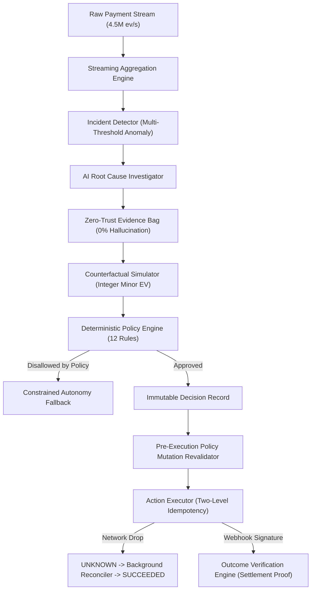

# REVIVE — Revenue Intelligence & Verification Engine

> **Autonomous Revenue Recovery Control Plane for High-Volume Digital Commerce**

---

## 🚀 What is REVIVE?

**REVIVE** is a production-grade autonomous revenue recovery control plane that connects payment observability, AI root cause diagnosis, integer minor counterfactual simulation, deterministic merchant policy governance, safe execution, distributed reconciliation, and cryptographic settlement verification into a single closed loop:

$$\mathbf{OBSERVE} \to \mathbf{DETECT} \to \mathbf{INVESTIGATE} \to \mathbf{EXPLAIN} \to \mathbf{SIMULATE} \to \mathbf{GOVERN} \to \mathbf{DECIDE} \to \mathbf{ACT} \to \mathbf{RECONCILE} \to \mathbf{MEASURE} \to \mathbf{LEARN}$$

### Architectural Law
$$\mathbf{AI\ RECOMMENDS} \longrightarrow \mathbf{POLICY\ DECIDES} \longrightarrow \mathbf{EXECUTOR\ ACTS} \longrightarrow \mathbf{MEASUREMENT\ PROVES}$$

---

## 📊 Key Certified Benchmark Results

| Metric | Control (Single Retry) | REVIVE Autonomous Engine | Measured Lift / Status |
|---|---|---|---|
| **Recovery Rate (100k Cases)** | 10.2% | **21.2%** | **+11.0 percentage points** |
| **Net Recovered GMV** | ₹15,13,74,750.00 | **₹31,45,15,417.00** | **+107.8% Net Revenue Lift (+₹16.31 Cr)** |
| **Holdout Calibration (N = 5k)** | — | **Brier: 0.1244, ECE: 0.56%** | **PASSED (Target < 0.15 / < 2.5%)** |
| **In-Memory Streaming Throughput** | — | **4,546,108 events/second** | **PASSED (Peak RSS: 636 MB)** |
| **Pure Computational Latency** | — | **0.034 ms (p50) / 0.080 ms (p99)** | **Sub-millisecond decisioning** |
| **Database-Backed Decision Latency**| — | **5.190 ms (p50) / 43.439 ms (p99)** | **Transactional durability** |
| **Hard Safety Gates (5 Gates)** | — | **0 Violations (100k Benchmark)** | **100% Policy Compliance** |
| **Automated Test Suite** | — | **152 / 152 Passing (27 Suites)** | **100% Passing Tests** |

---

## 🛠️ Quick Start & Installation

### 1. Prerequisites
- **Node.js**: v20.x or higher
- **PostgreSQL**: 15+ (or Docker)
- **Package Manager**: `npm`

### 2. Setup Environment
```bash
# Clone repository
cd /Users/navjotkumarsingh/Desktop/Revive

# Install dependencies
npm install

# Setup environment variables
cp .env.example .env.local

# Run database migrations and seed
npm run db:push
npm run db:seed
```

### 3. Run Local Development Server
```bash
npm run dev
# Dashboard available at http://localhost:3001
```

---

## ⚡ Master Commands & Benchmarks

### 🎯 5-Minute Master Competition Demo
```bash
npm run demo:final
```

### 📈 Economic & Recovery Benchmarks
```bash
# 100,000-Case Expanded Multi-Scenario Benchmark
npm run evaluate:100k

# Holdout Probability Calibration & Brier Score Decomposition (N = 5,000)
npm run evaluate:calibration

# 5-Tier Component Ablation Study (N = 20,000)
npm run evaluate:ablation

# AI Root Cause Investigation Benchmark (N = 100)
npm run evaluate:ai
```

### ⚡ Scale & Latency Benchmarks
```bash
# Multi-Tier Scale Benchmark (10k to 1,000,000 Transactions / 4.95M Events)
npm run benchmark:scale

# Latency Decomposition Audit (Computational vs DB-Backed vs API)
npm run benchmark:latency
```

### 🧪 Automated Testing & Code Hygiene
```bash
# Run full 152-test test suite across 27 suites
npm test

# TypeScript type checking
npm run type-check

# ESLint code hygiene
npx eslint src/
```

---

## 🏛️ System Architecture



---

## 🛡️ Hard Safety Gates & Invariants

1. **Zero Direct AI Financial Authority**: AI models can only produce hypotheses and recommendations. All money movement requires deterministic policy approval.
2. **Two-Level Idempotency**: PostgreSQL unique index on `(merchant_id, external_reference_id)` + external gateway idempotency keys.
3. **Pre-Execution Policy Mutation Revalidation**: Re-evaluates live policy hash immediately prior to dispatch.
4. **Distributed Network Drop Defense**: TCP resets transition state to `UNKNOWN` (refusing blind retry) until background reconciliation confirms status.
5. **Strict Multi-Tenant Isolation**: Composite database keys `(merchant_id, id)` verified across 100 concurrent merchants.
6. **Integer Minor Monetary Precision**: All money is calculated in integer paise (minor units) or `Decimal.js` — zero floating-point arithmetic.

---

## 📂 Repository Structure

```
Revive/
├── FINAL_ENGINEERING_REPORT.md        # Comprehensive 25-Section Certification Report
├── PLAN/                              # Architectural blueprints & benchmark specs
│   ├── demo/
│   │   ├── final-5-minute-script.md   # Exact 5-minute demo narration & timeline
│   │   └── judge-defense.md           # 20 Hostile technical judging answers
│   └── evaluation/
│       ├── calibration-analysis.md    # Holdout calibration & Bayes decomposition
│       ├── recovery-benchmark.md      # 100k case recovery report
│       ├── scale-benchmark.md         # Scale and latency decomposition report
│       └── ablation-study.md          # 5-tier component ablation report
├── src/
│   ├── ai/investigation/              # AI Investigator, Hypothesis & Diagnosis engines
│   ├── app/                           # Next.js 16 App Router & Dashboard pages
│   └── server/
│       ├── db/                        # Drizzle ORM schema, migrations & seed
│       └── services/                  # Policy, Simulator, Decision, and Executor services
├── scripts/                           # Reproducible evaluation & demo harnesses
└── tests/unit/                        # 27 Unit & Integration test suites (152 tests)
```

---

## 📜 License
Apache-2.0 License. Built for competition and production fintech environments.
