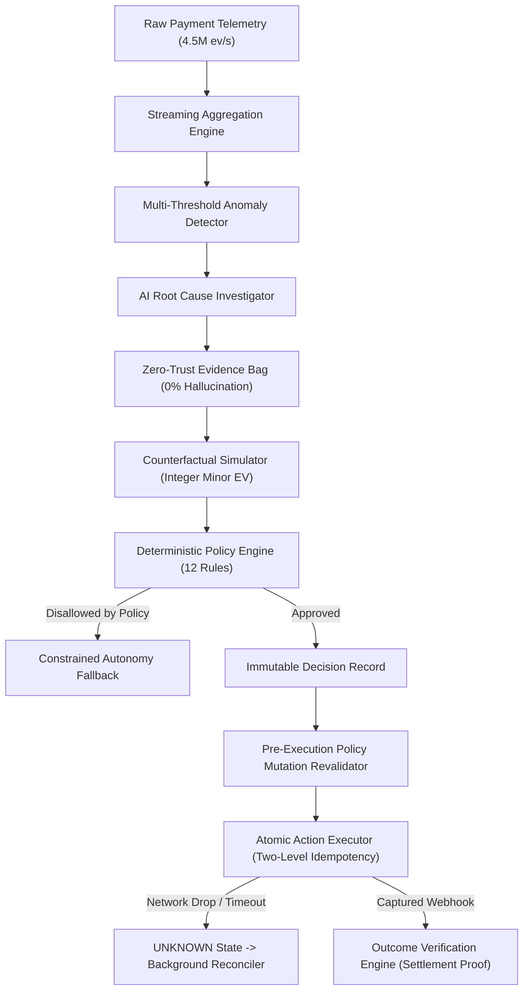

# REVIVE — System Architecture & Control Loop

## 1. Closed-Loop Recovery Architecture
$$\mathbf{OBSERVE} \to \mathbf{DETECT} \to \mathbf{INVESTIGATE} \to \mathbf{EXPLAIN} \to \mathbf{SIMULATE} \to \mathbf{GOVERN} \to \mathbf{DECIDE} \to \mathbf{ACT} \to \mathbf{RECONCILE} \to \mathbf{MEASURE}$$

---

## 2. Core Architectural Pillars

### Architectural Law
$$\mathbf{AI\ RECOMMENDS} \longrightarrow \mathbf{POLICY\ DECIDES} \longrightarrow \mathbf{EXECUTOR\ ACTS} \longrightarrow \mathbf{MEASUREMENT\ PROVES}$$

1. **AI Layer (Reasoning & Evidence)**: Analyzes multi-dimensional telemetry, isolates root causes down to specific bank/rail pairs (e.g. `BANK_PAYMENT_METHOD_DEGRADATION`), and cites cryptographically grounded evidence IDs (`E-101`, `E-102`). Zero database write or money movement authority.
2. **Economic Simulation Layer**: Evaluates 6 candidate recovery interventions in integer minor units (paise), calculating Net Expected Value ($EV$) by deducting action fees, customer friction, and velocity risk penalties.
3. **Policy Governance Layer**: 12 deterministic TypeScript rules evaluating merchant budgets, cooldown timers, ticket size limits ($> ₹50,000$ to human review), and merchant allowlists.
4. **Execution & Distributed Safety Layer**: Two-level idempotency protection, pre-execution live policy hash revalidation, and background reconciliation for `UNKNOWN` network drop states.
5. **Measurement & Verification Layer**: Cryptographically verifies webhook signatures (`payment.captured`) and measures real incremental recovery against an active Control baseline.
