# REVIVE — 60-Second Architecture Walkthrough & Master Diagram

## 1. The 60-Second Architecture Talk Track
> "REVIVE is built as a high-performance modular monolith in Next.js 16 with TypeScript and PostgreSQL.
> 
> The architecture is strictly decoupled into five functional layers:
> 1. **Streaming Ingestion**: Processes live telemetry streams at 4.5 million events per second in memory, grouping events into 5m, 15m, and 60m sliding windows to detect systemic degradation anomalies.
> 2. **AI Investigation Layer**: Synthesizes multi-dimensional telemetry into verified Evidence Bags. It diagnoses root causes with 98% confidence and zero hallucinations. **Critically, this AI service has zero database mutation credentials and zero payment execution authority.**
> 3. **Counterfactual Simulation**: Evaluates 6 recovery alternatives using integer minor-unit Net Expected Value ($EV$), factoring in probability, action fees, customer friction, and velocity risk.
> 4. **Deterministic Policy Engine**: 12 strict TypeScript rules evaluate merchant budgets, velocity limits, and allowlists. If the highest-EV action is denied, Constrained Autonomy safely selects the next-best permitted action.
> 5. **Safe Execution & Reconciler**: Dispatches actions with two-level idempotency and pre-execution policy hash validation. If upstream network drops occur, the action enters an `UNKNOWN` state and background reconciliation polls the provider reference until proven."

---

## 2. Master System Architecture Diagram

```mermaid
flowchart TD
    subgraph TELEMETRY_STREAM ["1. High-Volume Telemetry Layer"]
        A["Payment Events Stream (4.5M ev/s)"] --> B["In-Memory Streaming Aggregator"]
        B --> C["Multi-Threshold Incident Detector"]
    end

    subgraph AI_INVESTIGATION ["2. Zero-Trust AI Reasoning Layer"]
        C --> D["AI Root Cause Investigator"]
        D --> E["Evidence Verification Engine (0% Hallucination)"]
    end

    subgraph SIMULATION_GOVERNANCE ["3. Counterfactual Economics & Policy Engine"]
        E --> F["Counterfactual Simulator (Integer Minor EV)"]
        F --> G["12-Rule Deterministic Policy Engine"]
        G -->|Denied by Policy| H["Constrained Autonomy Fallback"]
        G -->|Approved| I["Immutable Decision Record (SHA-256 Hash)"]
    end

    subgraph EXECUTION_SAFETY ["4. Safe Execution & Reconciliation"]
        I --> J["Pre-Execution Policy Mutation Revalidator"]
        J --> K["Action Executor (Level-1 & Level-2 Idempotency)"]
        K --> L["Payment Gateway Test Adapter"]
        L -->|TCP Drop / Timeout| M["UNKNOWN State -> Background Reconciler"]
        L -->|Success Webhook| N["Settlement Proof Engine"]
    end

    subgraph CROSS_CUTTING ["5. Cross-Cutting Enterprise Rails"]
        O["Clerk Multi-Tenant Auth"]
        P["PostgreSQL (Drizzle ORM)"]
        Q["Append-Only Audit Ledger"]
        R["Observability & OpenTelemetry Probes"]
    end

    %% CRITICAL ARCHITECTURAL WALL: AI NEVER CONNECTS TO EXECUTOR
    D -.->|NO DIRECT CONNECTION| K
    
    style AI_INVESTIGATION fill:#2d1b4e,stroke:#9d4edd,stroke-width:2px
    style SIMULATION_GOVERNANCE fill:#1b3a4b,stroke:#00b4d8,stroke-width:2px
    style EXECUTION_SAFETY fill:#1b4332,stroke:#52b788,stroke-width:2px
```

