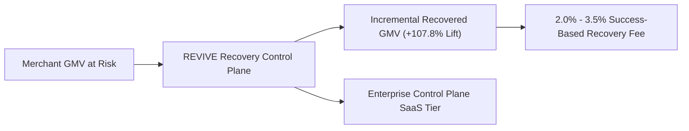

# REVIVE — Proposed Business Model & Unit Economics

> **Disclaimer**: This document details the proposed commercialization strategy and unit economic framework. All figures are illustrative models based on benchmark economics.

---

## 1. Value-Aligned Monetization Structure

### Stream 1: Value-Based Success Fee (Primary Revenue)
- **Model**: **2.0% – 3.5% fee on verified incremental recovered GMV**.
- **Alignment**: Merchants only pay when REVIVE successfully recovers a payment that would have failed under their baseline retry policy.
- **Proof Mechanism**: Cryptographically signed `payment.captured` webhooks tied to REVIVE action reference keys.

### Stream 2: Enterprise Control Plane SaaS (Platform Subscription)
- **Model**: **Tiered monthly subscription** ($₹49,999 – ₹2,49,999 / \text{month}$) for enterprise governance features:
  - Custom Policy DSL & allowlist configuration.
  - Multi-tenant operator seats & role-based access control (RBAC).
  - High-value VIP Human Review Queue integration.
  - Dedicated SLA and custom payment adapter development.

---

## 2. Unit Economic ROI Model for an Enterprise Merchant

| Merchant Dimension | Baseline Performance | With REVIVE Control Plane | Net Business Impact |
|---|---|---|---|
| **Monthly Processed GMV** | ₹100.00 Crores | ₹100.00 Crores | — |
| **Payment Failure Rate** | 10.0% (₹10.00 Cr at risk) | 10.0% (₹10.00 Cr at risk) | — |
| **Standard Gateway Recovery (10.2%)**| ₹1.02 Crores | — | Baseline |
| **REVIVE Recovery (21.2%)** | — | **₹2.12 Crores** | **+₹1.10 Crores Gross Lift** |
| **REVIVE Success Fee (2.5%)** | ₹0.00 | ₹5.30 Lakhs | Software Cost |
| **Action & Gateway Fees** | ₹0.50 Lakhs | ₹1.80 Lakhs | Execution Cost |
| **Net Merchant Revenue Added** | **₹0.00** | **+₹1.03 Crores / month** | **19.4x Software ROI** |
