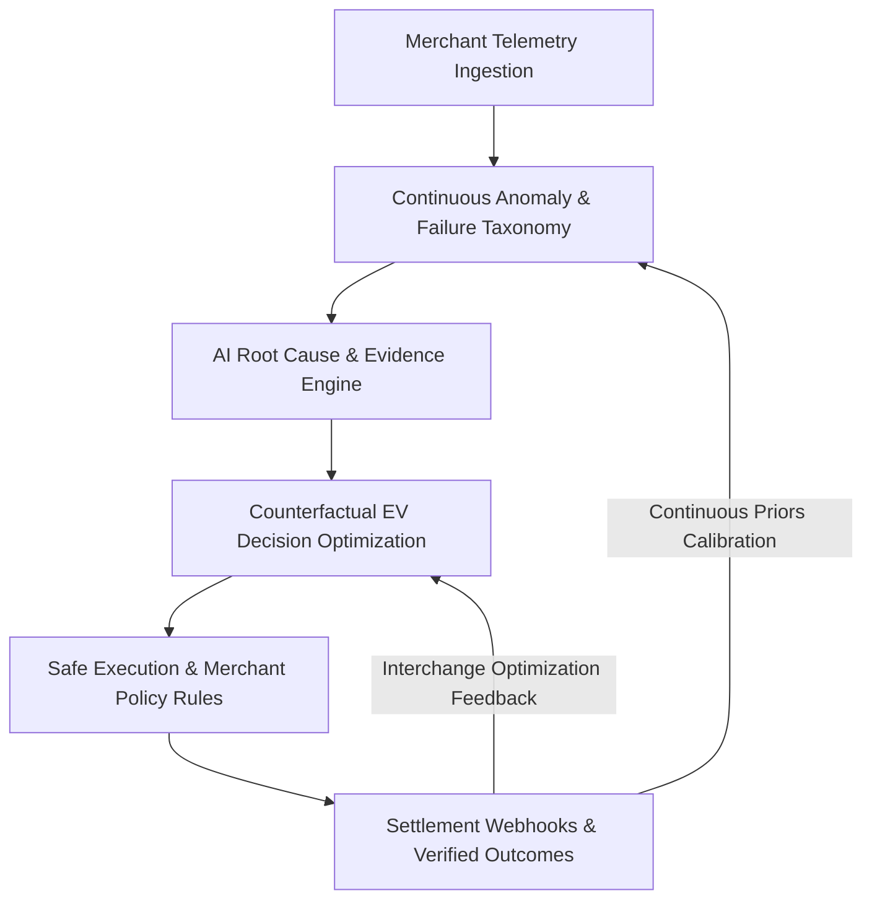

# REVIVE — Defensible Moat & Data Flywheel

## 1. The Core Defensibility Pillars

### Pillar 1: Proprietary Settlement Feedback Loop
Every completed recovery action writes an immutable record to `recovery_outcomes` recording predicted probability vs actual settlement delta. As transaction volume scales, REVIVE’s empirical Bayesian priors continuously sharpen, creating an expanding accuracy advantage that cannot be replicated by static heuristics.

### Pillar 2: Cross-Merchant Banking Switch Radar
Individual merchants observe only their own checkout traffic. REVIVE aggregates anonymized failure telemetry across thousands of merchants, enabling real-time detection of issuer bank outages (e.g. HDFC UPI switch degradation) within seconds—before individual merchants or payment gateways update their status pages.

### Pillar 3: Policy-Aware Governance Engine
Enterprises will not adopt unconstrained autonomous agents. REVIVE’s 12-rule deterministic policy DSL creates an enterprise integration lock-in: merchants configure custom risk budgets, cooldown timers, ticket caps, and acquirer allowlists that encode their exact operational and compliance posture.

### Pillar 4: Neutral Multi-Acquirer Positioning
Payment gateways (Razorpay, Stripe, Adyen) have structural conflicts of interest: they cannot impartially route traffic to competing acquirers or optimize merchant interchange across rival platforms. REVIVE sits above execution as an independent merchant-first control plane.
